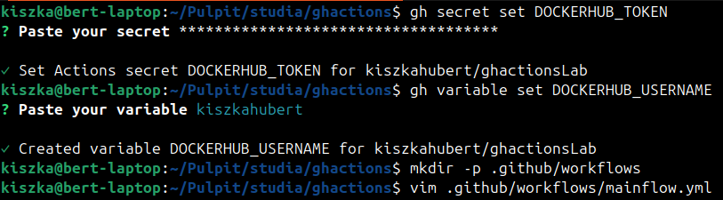
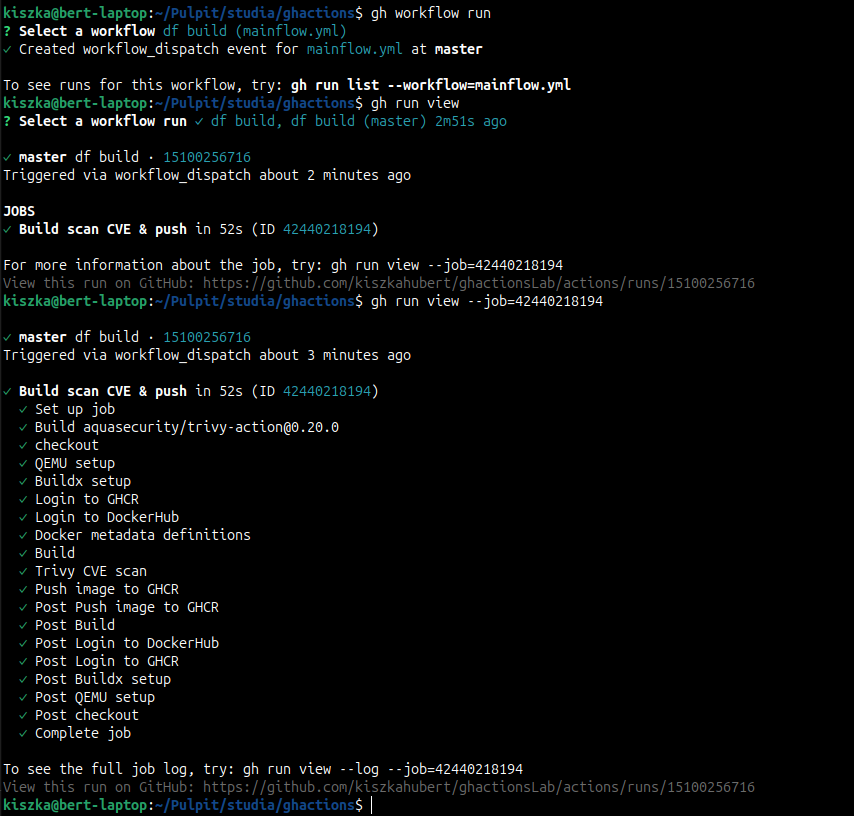
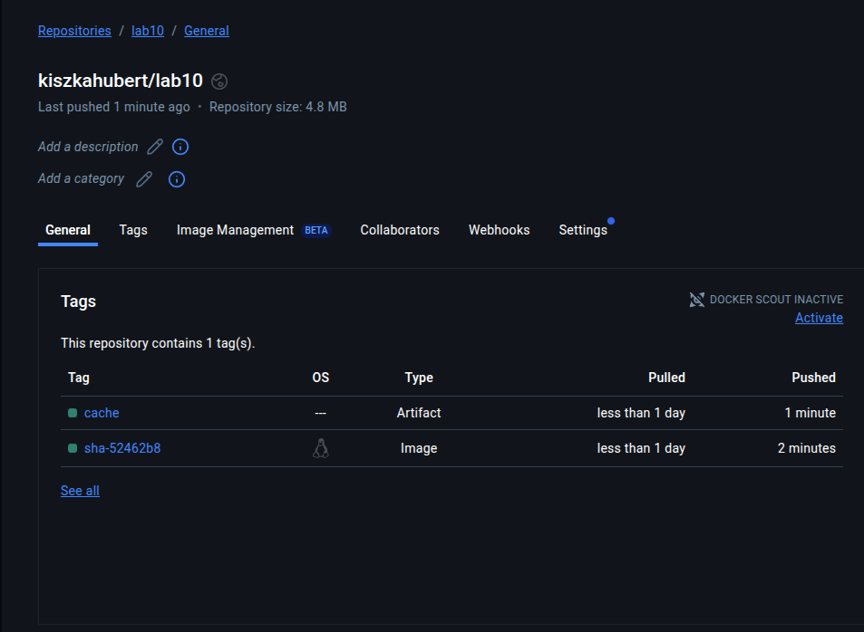
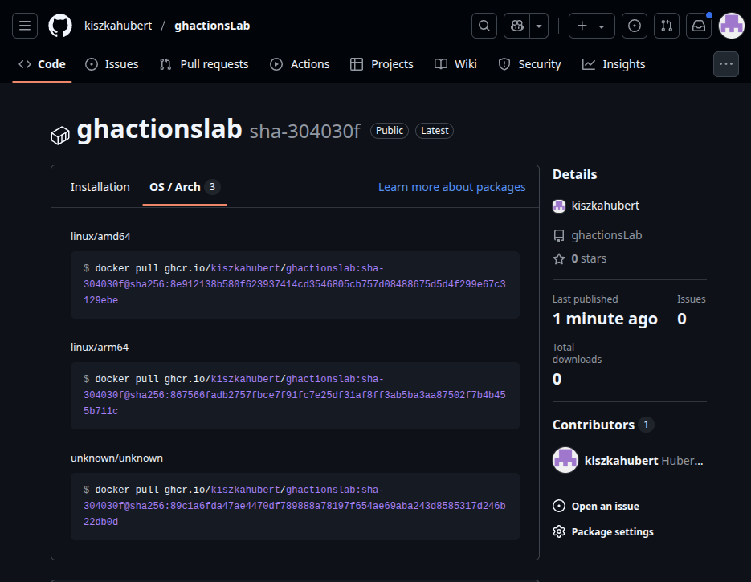

# Rozwiązanie zadania


Tworze zmienne które będą przechowywać dane do autoryzacji w DockerHub, oraz tworze folder w którym zostanie zdefiniowany workflow

Komendą `gh workflow run` uruchamiam wybrany workflow. Mogę tak zrobić ponieważ mam zdefiniowany dispatch

```
on:
  workflow_dispatch:

```

który pozwala na ręczne uruchomienie workflowu. Jak widać na powyższym zrzucie ekranu wszystko zakończyło się sukcesem i aby upewnić się możemy sprawdzić na DockerHub czy posiadamy cache tego obrazu oraz na ghcr.io czy obraz wspiera wymagane architektury.


1)Co do przyjętego schematu tagowania mamy do wyboru wersjonowanie semantyczne.
1.1) Najpierw wykonujemy komendę `git tag v1.1.1` w lokalnym repozytorium
1.2) Wypychamy commit poprzez `git push origin v1.1.1`
1.3) Przez to, że w naszym pliku opisującym workflow mamy trigger:
```
on:
  workflow_dispatch:
  push:
    tags:
    - 'v*'

```
oraz w docker/metadata-action zadeklarowalismy
```
type=semver,priority=200,pattern={{version}}
```
Nowy workflow uruchomi się w odpowiedzi na wykrycie pusha z tagiem który odpowiada temu wyżej przez nas zadklerowanemu. Dodatkowo docker/metadata-action wyciąga {{version}} z tego taga i używa go do otagowania obrazu który pushujemy do ghcr.io
2) Mamy również opcję tagownania za pomocą SHA co gwarantuje nam ten fragment
```
type=sha,prefix=sha-,format=short,priority=100
```
Jest to zapasowy sposób tagowania obrazów w tym przypadku ze względu na to, że ma mniejszy priorytet. Gdy ręcznie wykonamy workflow komendą `gh workflow run` obraz zostanie otagowany tagiem SHA.
Co do cachea wszystkie warstwy buildx eksportujemy do publicznego repozytorium DockerHub z którego również pobieramy cache obrazu. Tryb `mode=max` przechowuje pełne warstwy dzięki czemu kolejne buildy odtwarzają prawie cały cache.
