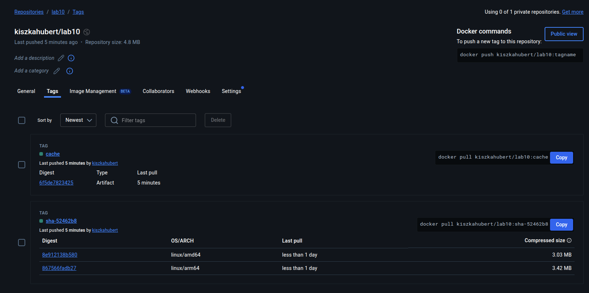

# Rozwiązanie zadania


Tworze zmienne które będą przechowywać dane do autoryzacji w DockerHub, oraz tworze folder w którym zostanie zdefiniowany workflow

Komendą `gh workflow run` uruchamiam wybrany workflow. Mogę tak zrobić ponieważ mam zdefiniowany dispatch

```
on:
  workflow_dispatch:

```

który pozwala na ręczne uruchomienie workflowu. Jak widać na powyższym zrzucie ekranu wszystko zakończyło się sukcesem i aby upewnić się możemy sprawdzić na DockerHub czy posiadamy cache tego obrazu oraz to czy obraz wspiera dwie wymagane architektury sprzętowe.


